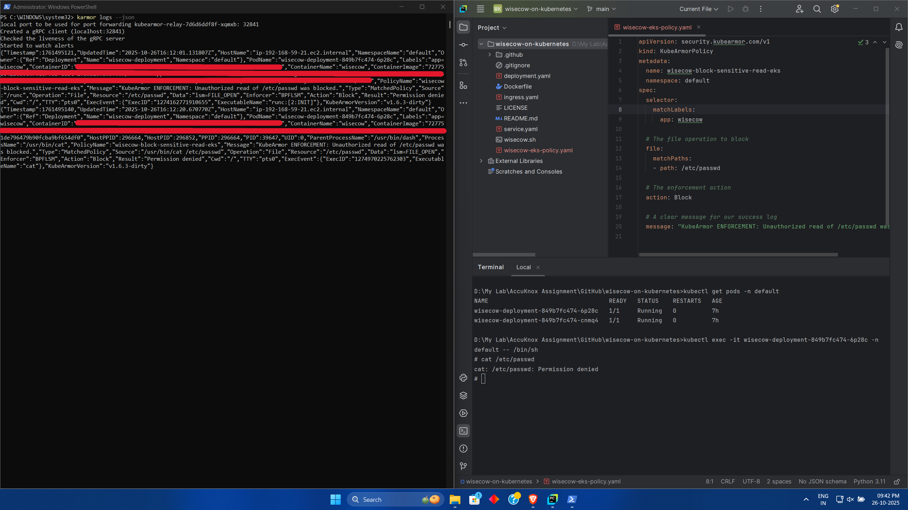

### Phase 2: A Deep Dive into Zero-Trust Runtime Security

The final phase of this project was dedicated to implementing a zero-trust runtime security policy using KubeArmor. What began as a straightforward task evolved into a deep, multi-layered diagnostic investigation that tested the limits of my troubleshooting skills and ultimately provided a more profound understanding of real-world security engineering.

#### The Goal
My objective was to create a strict security policy for the `wisecow` workload that would block any unauthorized behavior, starting with a simple attempt to read a sensitive file like `/etc/passwd`.

#### The Initial Challenge: Unraveling the "It Doesn't Work"
My first attempt involved applying a policy on my local Minikube environment. Despite the policy being syntactically correct, it failed to generate any alerts. This began an intensive troubleshooting journey to uncover the root cause.

1.  **First Clue: The Missing Enforcer.** The first breakthrough came from inspecting the KubeArmor agent's logs. I discovered a critical warning:
    > `INFO Disabled KubeArmor Enforcer since No LSM is enabled`
    This confirmed my local Minikube kernel lacked the necessary Linux Security Modules (LSMs) for enforcement, forcing KubeArmor into a degraded, audit-only mode.

2.  **Second Clue: A Broken Communication Bridge.** Even in audit mode, no logs were appearing. This led me to investigate the communication flow. By checking the logs of the `kubearmor-relay` pod, I found it was failing to connect to the agent, indicating an internal cluster networking issue.
    > `...connection error: desc = "transport: Error while dialing: ... connect: connection refused"`

3.  **The Root Cause: A Faulty Foundation.** Bypassing the relay and streaming logs directly from the KubeArmor agent pod revealed the final, definitive root cause. The agent itself was failing to initialize its monitoring engine because it could not connect to the Docker runtime socket.
    > `ERROR Failed to create new Docker client: ... malformed HTTP response`

This discovery was crucial. It proved that the issue was not with my policy or my commands, but a fundamental environmental incompatibility between KubeArmor and the specific Docker runtime configuration within my local Minikube setup.

#### The Strategic Pivot: From Local Lab to Live Environment

With the local environment proven unsuitable for enforcement, I made the strategic decision to pivot. I transitioned the test to the production-like **Amazon EKS cluster**, which runs on an OS with the necessary LSM capabilities.

I crafted a new policy, this time with a definitive `action: Block`, and applied it to the live `wisecow` deployment.

#### The Final Success: Definitive Enforcement

The result was immediate and conclusive.

*   The attempt to read `/etc/passwd` from within the container was instantly met with a **`Permission denied`** error.
*   Simultaneously, the KubeArmor log stream captured a JSON alert confirming the action was successfully **`Blocked`**.

This successful test was the culmination of hours of persistent debugging. The journey from a non-functional local test to a successful block in a live cloud environment was an invaluable learning experience, far exceeding the original scope of the problem statement.

#### Proof of Enforcement

The following screenshot captures the final, successful test. The right terminal shows the "Permission denied" error upon attempting to access the file, and the left terminal shows the corresponding "Block" alert from KubeArmor, validating that the zero-trust policy was fully enforced.

This experience was a powerful lesson in the realities of DevOps and security engineering: tools are only as effective as the environment they run in, and the ability to diagnose issues across complex, layered systems is a critical skill.
